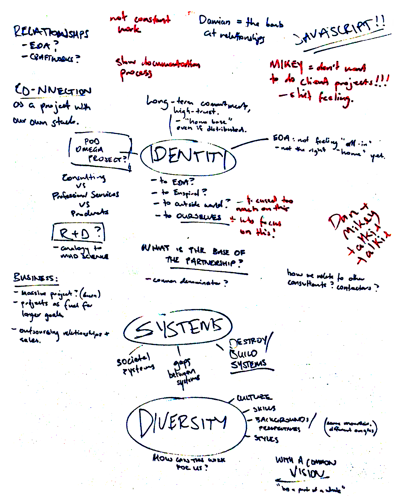
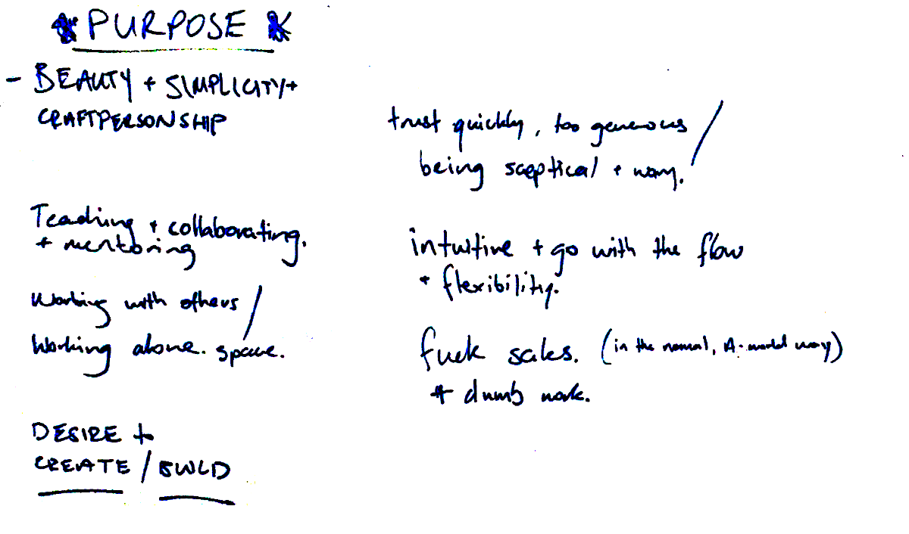
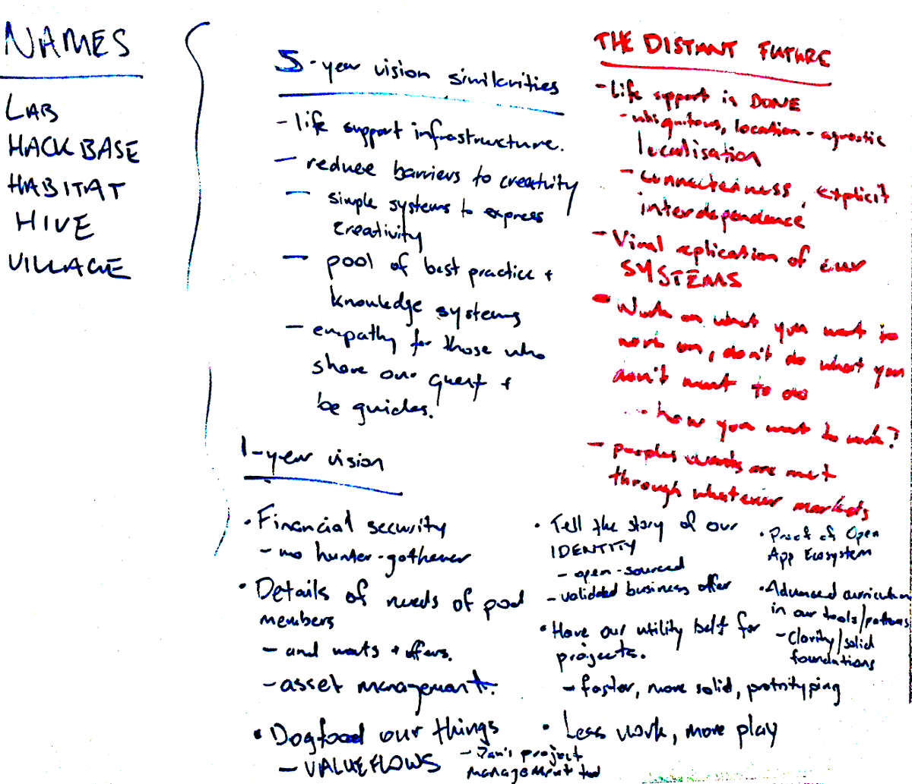
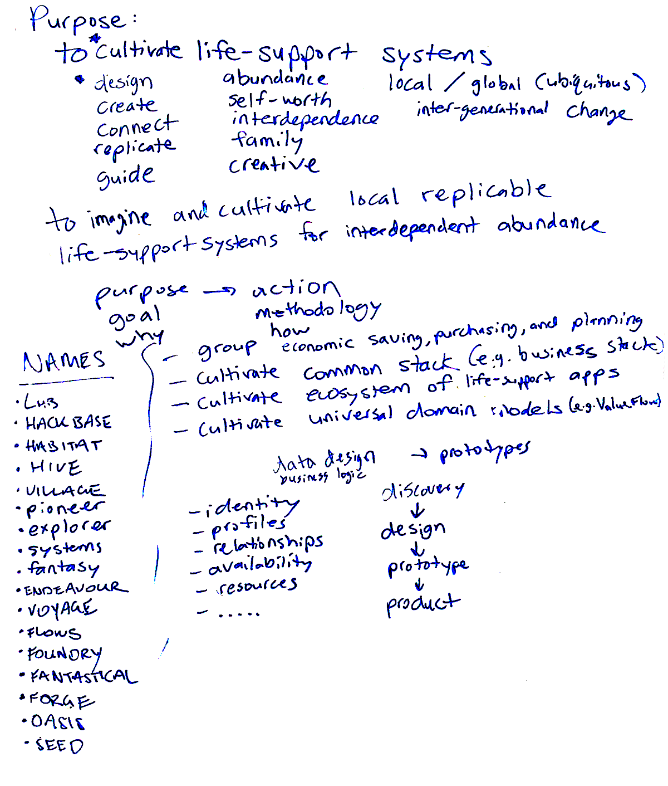
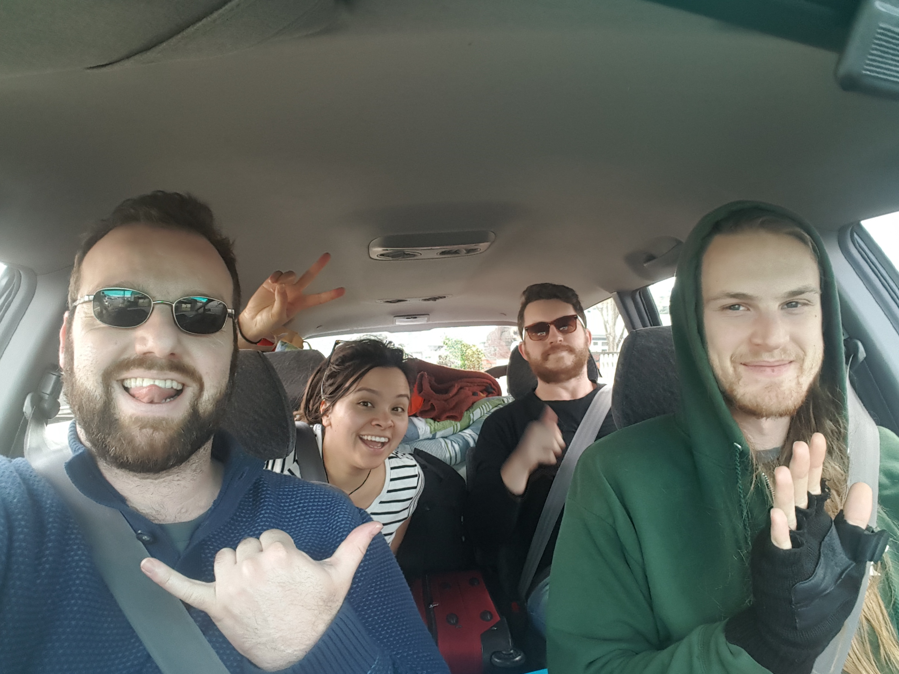
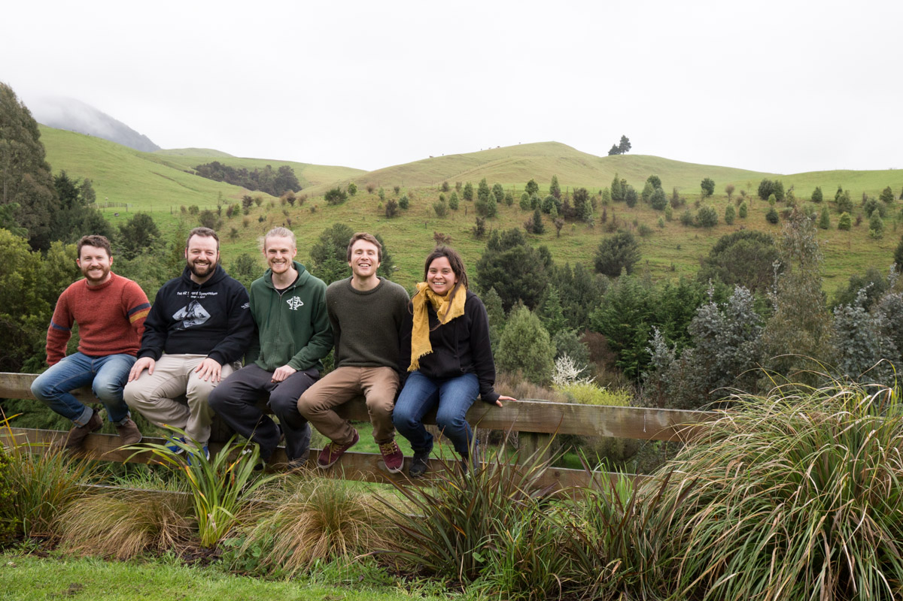

# History of Root Systems

(_not an objective historical account, see commit history for personal authorship_)

Root Systems grew out of the primordial ooze of [Enspiral](http://enspiral.com), specifically [Enspiral Dev Academy](http://devacademy.co.nz) and [Enspiral Craftworks](http://craftworks.enspiral.com/).

In order to bootstrap EDA during early days, [Joshua Vial](http://joshuavial.com/) and other senior developer teachers at the time relied on a tried-and-true method to earn revenue: consulting! While this worked great at the time, since the teachers all had experience doing their own contracts, but over time as the staff turned over there was a leftover meme of doing consulting without the same experience or leadership.

In this period, consulting was done as a swarm, similar to [Enspiral Craftworks](http://craftworks.enspiral.com), but with some [self-set salary](http://joshuavial.com/self-determined-salaries/) expectations for staff committed to EDA. While the swarm did loose coordination to wrangle contracts, at this time the group was overall unsuccessful and over time had more outgoing salary expenditures than incoming revenue. At this time it wasn't clear who was in and who was out (loose membership), nor what we were doing with ourselves other than contracting (lack of a shared purpose).

Once it became clear the swarm way of working was failing, with a gap in work during April 2015, Daniel Lewis proposed to those committed to consulting within EDA to spend two days per week focusing on the core of the group. We then organized two full days per week in a nearby "Loki Lounge" to do discovery workshops on our core purpose and strategy. 

After our initial workshop, we planted our name "Root Systems" and created private channels to communicate.

In this next period, with tight membership and a clear purpose, Daniel Lewis led the coordination of our business. Damian Sligo-Green partnered with us to nurture client relationships. Michael Smith and Daniel drafted [our financial model](https://medium.com/enspiral-tales/a-new-financial-model-for-consulting-c7781661a1ec). We began our rhythm of meeting every week over lunch to check-in and have face-to-face time. We continued to have a swarm of contributors around us doing contracting within the same space, which allowed us to pursue more contracts and support more humans, but we kept expectations such that we could not guarantee anything for loose contributors.

We had our first retreat in September 2016, where we mostly hung out and ate delicious food.

To be continued...
