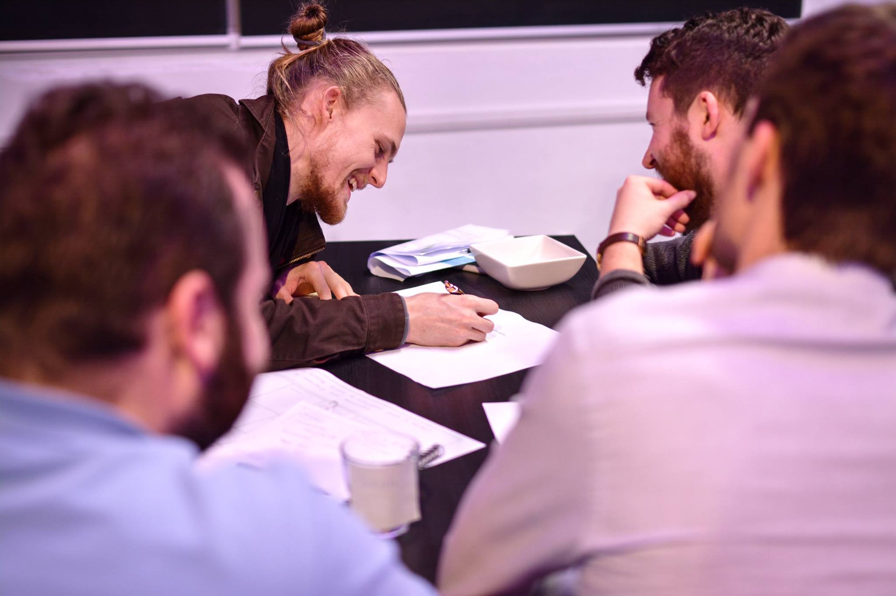
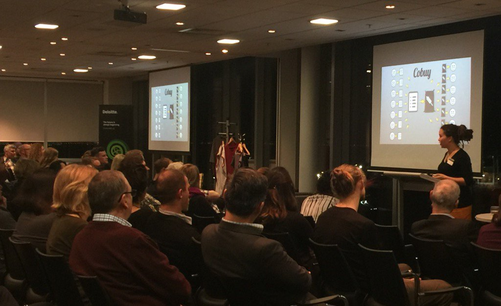
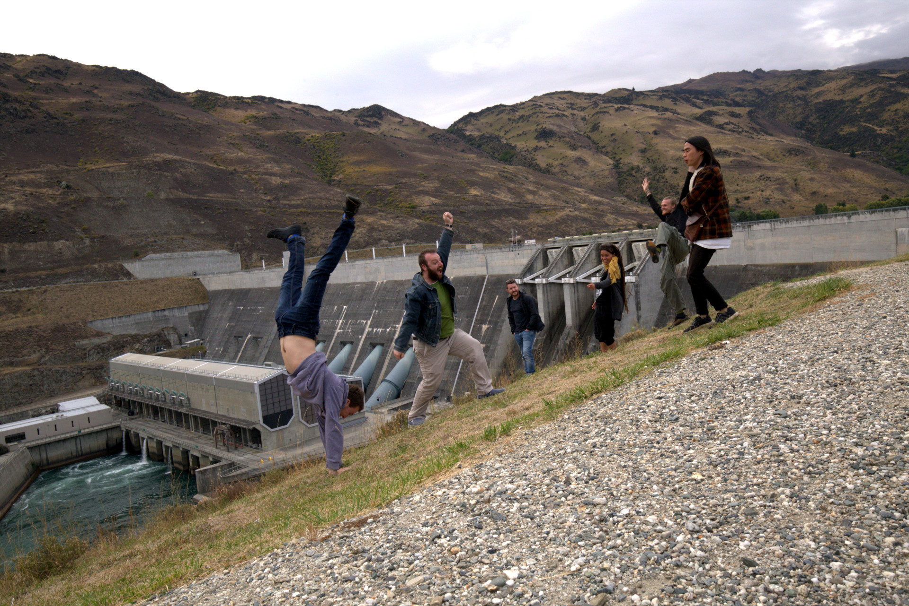
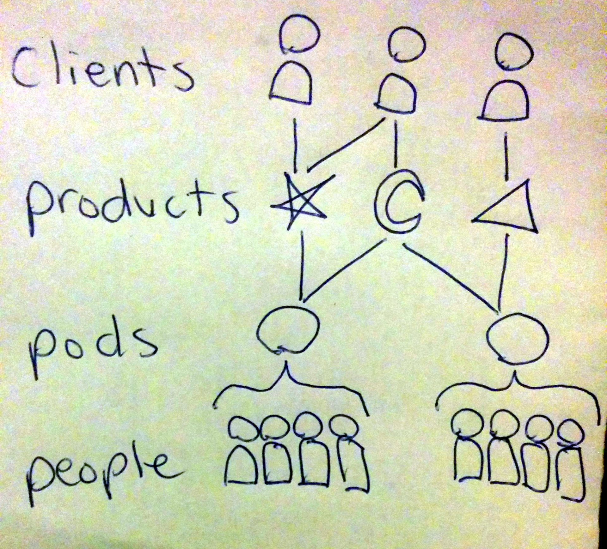
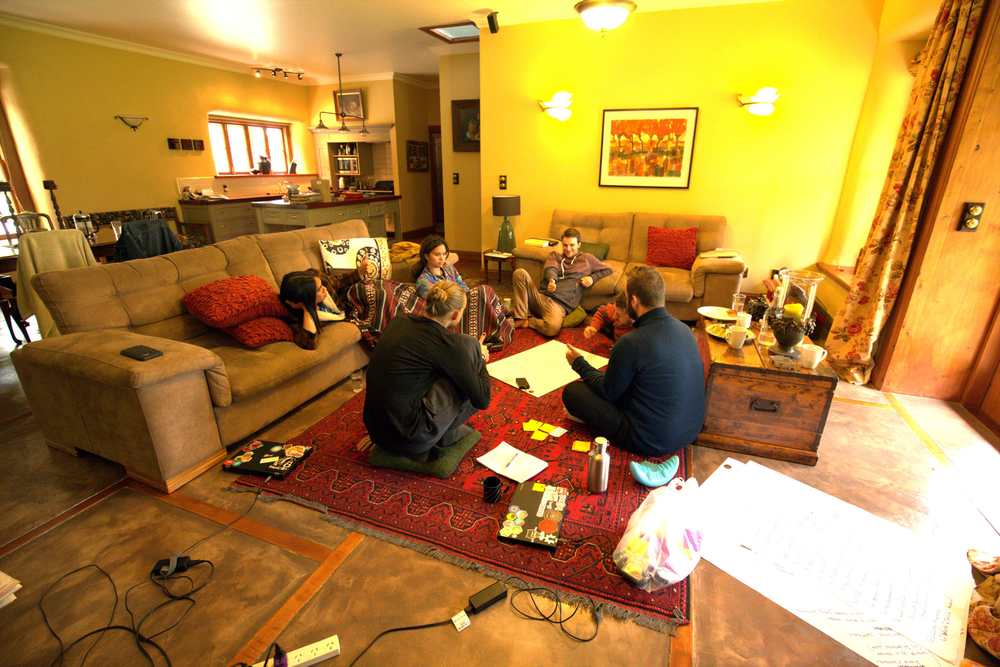

# History of Root Systems

(_not an objective historical account, see commit history for personal authorship_)

Root Systems grew out of the primordial ooze of [Enspiral](http://enspiral.com), specifically [Enspiral Dev Academy](http://devacademy.co.nz) and [Enspiral Craftworks](http://craftworks.enspiral.com/).

In order to bootstrap EDA during the early days, [Joshua Vial](http://joshuavial.com/) and other senior developer teachers at the time relied on a tried-and-true method to earn revenue: consulting! This worked great at the time, since the teachers all had experience doing their own contracts, but over time as the staff turned over there was a leftover meme of doing consulting without the same experience or leadership.

In this period, consulting was done as a swarm, similar to [Enspiral Craftworks](http://craftworks.enspiral.com), but with some [self-set salary](http://joshuavial.com/self-determined-salaries/) expectations for staff committed to EDA. While the swarm did loose coordination to wrangle contracts, at this time the group was overall unsuccessful and over time had more outgoing salary expenditures than incoming revenue. At this time it wasn't clear who was in and who was out (loose membership), nor what we were doing with ourselves other than contracting (lack of a shared purpose).

Once it became clear the swarm way of working was failing, with a gap in work during April 2016, Dan proposed to those committed to consulting within EDA to spend two days per week focusing on the core of the group. We then organised two full days per week in the nearby "Loki Lounge" to do discovery workshops on our core purpose and strategy. The initial members who showed up to this were Dan Lewis, Mikey Williams, Iain Kirkpatrick, Michael Smith, and Sarah Rogers.

After our initial workshop, we planted our name "Root Systems" and created private channels to communicate.

In this next period, with tight membership and a clear purpose, Dan led the coordination of our business. Damian Sligo-Green partnered with us to nurture client relationships. Michael and Dan drafted [our financial model](https://medium.com/enspiral-tales/a-new-financial-model-for-consulting-c7781661a1ec). We began our rhythm of meeting every week over lunch to check-in and have face-to-face time. We continued to have a swarm of contributors around us doing contracting within the same space, which allowed us to pursue more contracts and support more humans, but we kept expectations such that we could not guarantee anything for loose contributors.

From June - August 2016, Root Systems started doing business development for our first product - [Cobuy](../../products/cobuy/readme.html) - by participating in the Low Carbon Challenge.

We had our first retreat in September 2016, where we mostly hung out and ate delicious food.

For our next few cycles of the moon, we:

- [participated in the OpenIDEO challenge](https://challenges.openideo.com/challenge/food-waste/top-ideas/cobuy-group-buying-software-that-helps-people-buy-good-food-at-good-prices-together)
- had inter-personal conflict between two members, resolved with a radical non-verbal conflict resolution process involving hugs!
- our primary coordinator burnt out from doing all the things all the time
  - then start experimenting with our coordinator and director roles
- many of us operating remote for a few months

In early December 2016, we started a company: Root Systems Limited.

During our southern hemisphere summer in 2017 (January - March), we:

- had our second retreat in Alexandra, [read about it here](https://viewer.scuttlebot.io/%25bIUaaGaez1Kq6wPcewpcKNEA78O6x5%2FI8QIriUVbI94%3D.sha256)!
- Greg officially joined as a new member
- other pods like [Protozoa](http://protozoa.nz) incorporated
- started and pivoted our experiment with [`catstack`](https://github.com/enspiral-root-systems/catstack), now [`dogstack`](https://dogstack.js.org)

For our next quarter, we

- had our first away day, [read about it here](https://viewer.scuttlebot.io/%25P31bgqX6MBPD%2BJOXxquOlq5TRH9EPeJarPqDJ9APYIM%3D.sha256)
- Michael embarked on an OE (Overseas Experience)

_to be continued_
