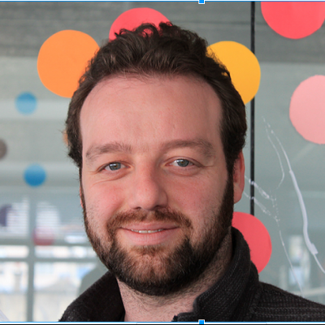
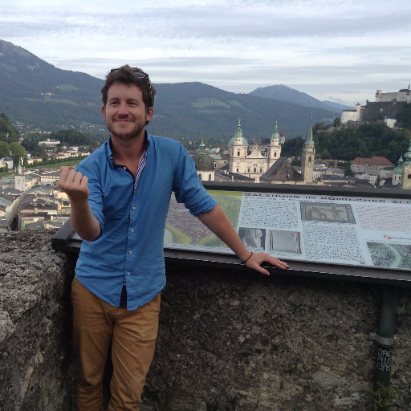
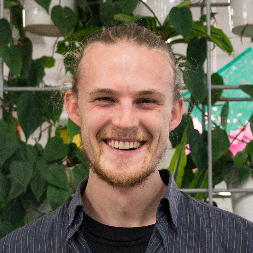
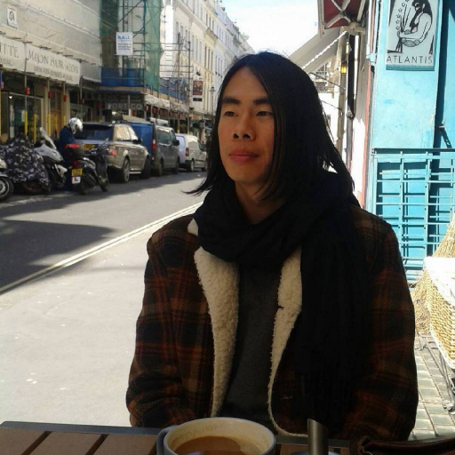

# Root Systems Members

### [Dan Lewis](https://github.com/agentlewis)

Dan loves to learn and fix things. Tinkering and evolving a plan to deal with a problem so as to create the most robust solution gives him immense satisfaction. In 2014 he attended Enspiral Dev Academy, leveling up as a developer. This built on the communication, project management and solution design theory he learned while studying Architecture and working as a disability healthcare provisioner. During the last decade he's travelled to many countries, lived in three, learnt Swedish and fell in love with the complexity and diversity of our world. He is "famous" for saying Poppycock on nationaal tv - see whatnext.nz S01E03

### [Iain Kirkpatrick](https://github.com/iainkirkpatrick/)

Iain is based in Wellington. He is interested in basketball and archaeology in Upper Mesopotamia, specifically tell sites, formed from the accumulated remains of people living on the same site for hundreds or thousands of years. Excavating a tell can reveal buried structures such as government or military buildings, religious shrines and homes, located at different depths depending on their date of use.

 

### [Michael Smith](https://github.com/NotThatSmith)

Michael is a developer based in Europe. He is interested in the potential for technology to aid and augment mental health and wellbeing. He is also a well-known producer of diamond knives for medical and scientific applications.

 
 

### [Mikey Williams](https://github.com/ahdinosaur)

Mikey is an { artist , developer , teacher } working in [Enspiral](https://enspiral.com/) on [software](https://dogstack.js.org/) for [sustainable economic networks](https://www.valueflo.ws). he also helps maintain [the Scuttlebutt ecosystem](https://www.scuttlebutt.nz/) and organizes [Art~Hack Wellington](https://www.facebook.com/groups/714447698702058/). In his spare time, he curates a list of cathedrals in Botswana, sorted by denomination, and considers how the ringing of bells is both a mourning and a celebration.

 

### [Sarah Rogers](https://github.com/sarah-arrrgh)

Sarah is a Wellington-based human whose life experience to date includes coding, starting a local food buying group, and growing another, smaller human inside her belly. Snuggling up with her daughter under a crochet blanket with a hot toddy under the stars is her idea of a really excellent time. Sometimes she turns into a sacred grove of trees that can see clearly through darkness, smoke, dust and fog.

### [Greg Kan](https://github.com/gregorykan)

Greg is a developer and poet based in Wellington. His writing has featured in various journals, catalogues and anthologies. His first book, published in 2015, was nominated for the Kathleen Grattan Poetry Award, as well as the Ockham New Zealand Book Award for Best Poetry. He sees both programming and poetry as contributing to an essential question - how language creates and organizes worlds.
