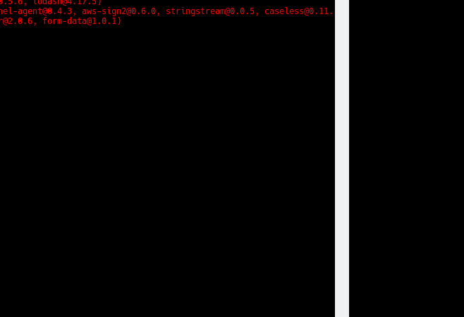

## Stewardship

From the Enspiral handbook -

Your steward looks after your relationship with the group, your one guaranteed point of contact. You and your steward can agree the scope of the role together. As a suggested start point, they should check in with you once per month to see how you’re going.

From the Loomio Handbook -

Every stewarding relationship is different, and there are many different approaches. Some are more conversational and friendly, with mutual sharing from both parties. Sometimes stewards offer advice or challenges. Other times they simply listen. Sometimes they follow a more structured pattern, checking in on action points or measuring progress over time.

The important thing is that the approach works for the stewardee. Stewarding is their time to get the support they need to bring their best self to the co-op.

Your steward might ask you questions like:

- how was last month? what did you like or dislike?
- what do you want to do differently this month?
- what longer term goals are you working on? how are you progressing on them since last time?
- how can I best support you?
- ...and sometimes the co-op will suggest a prompt or theme for stewards to bring up
