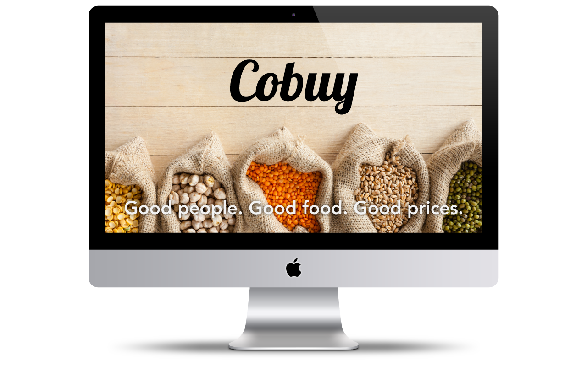
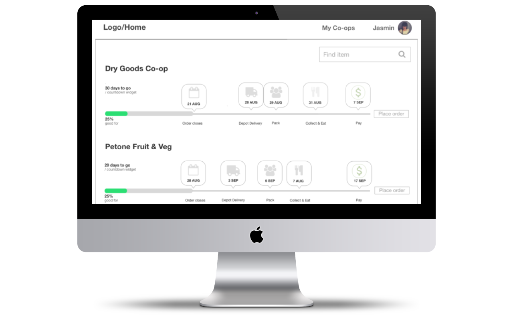
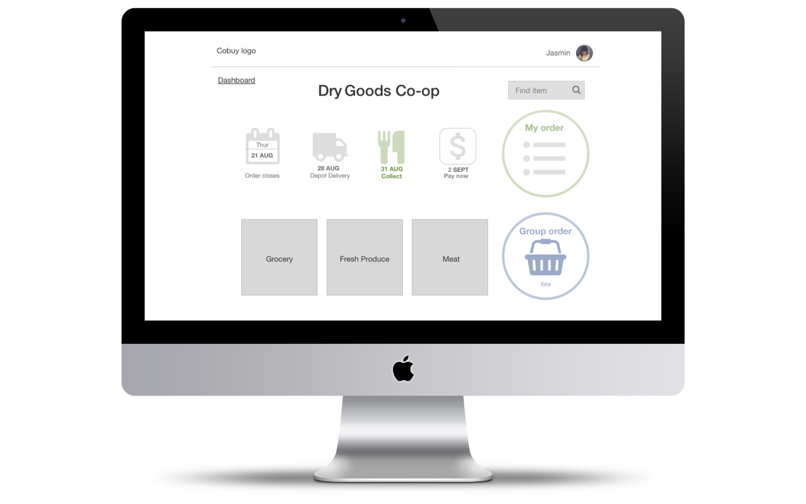
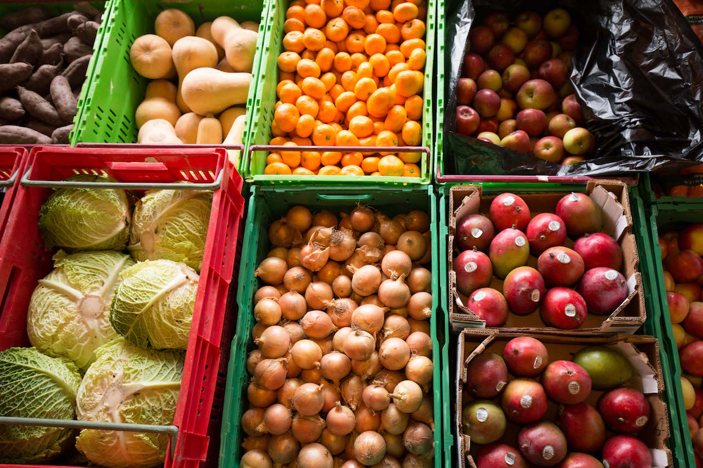
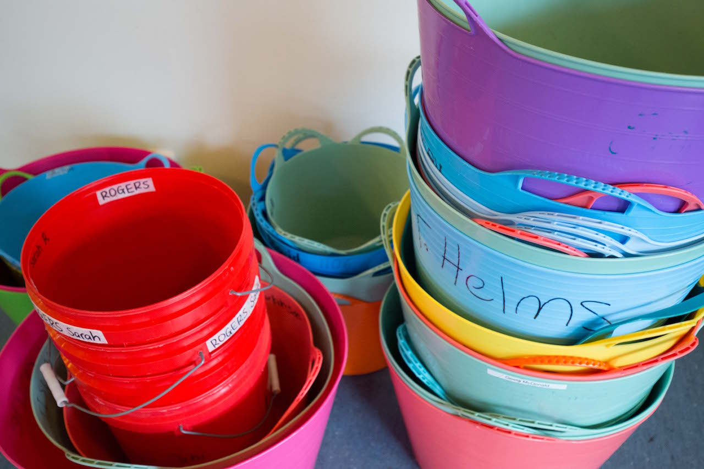
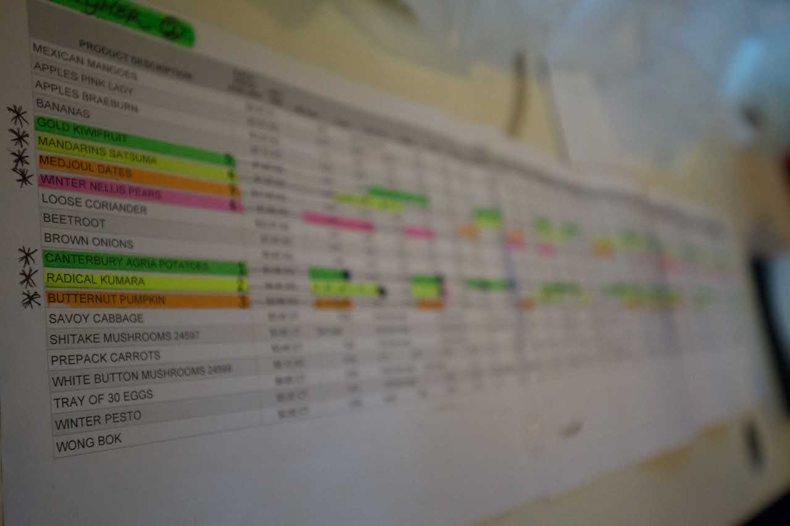
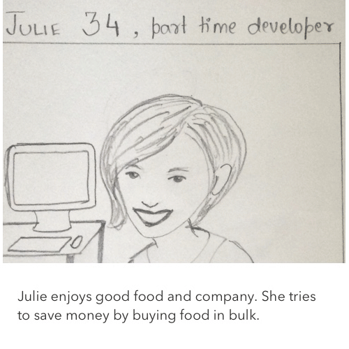
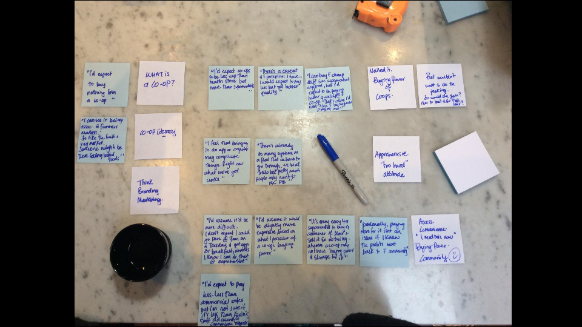
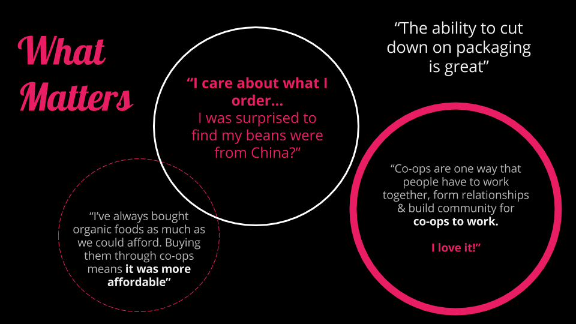
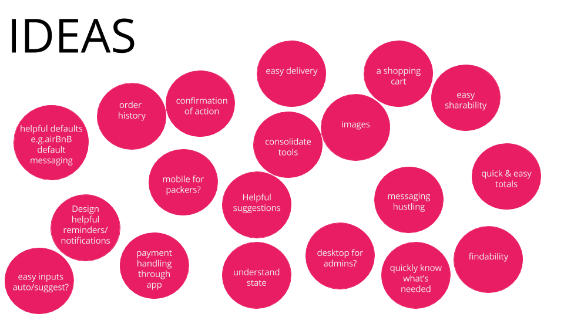

# [Cobuy](http://cobuy.nz)

> Group buying software that helps people buy good food at good prices, together.

Group buying directly from wholesalers eliminates supply chain waste in the retail sector & minimises packaging as items are bought in bulk.

<link  href="http://cdnjs.cloudflare.com/ajax/libs/fotorama/4.6.4/fotorama.css" rel="stylesheet" />

  
  
  
  
  
  
  

<iframe allowfullscreen="" frameborder="0" height="360" src="//player.vimeo.com/video/186511821" width="640"></iframe>

## What is Cobuy?

Cobuy is an app that makes buying groups/co-ops **easy to start, maintain, and grow**. Using the collective buying power of a group, people can buy food in bulk directly from wholesalers. By cutting out retailers, we effectively **eliminate retail food waste**, save money and have access to a wider range of better quality products.

Sign up for early access at [Cobuy.nz](http://cobuy.nz)!

_(Note: Our definition of a co-op is a group of people who buy together, so the terms "buying group" and "co-op" are used interchangeably.)_

## The problem

### Typical supply chains waste food

A huge amount of food is wasted as it travels through the supply chain to the consumer. While consumers are the main culprits (buying too much food and then having it spoil), retailers also waste significant quantities. They buy to stock shelves, and when food spoils before it is sold it is sent to landfill. Countdown is one of the main supermarket chains in NZ, and they alone send over 10,000 tonnes of food to landfill each year.

The table below shows that 10% of all food in the supply chain is wasted at the retail level. 

### Co-ops are tough to manage

Many co-ops currently use spreadsheets to manage their orders and finances. Spreadsheets can be a good tool to begin with, but quickly grow to be complex, unstable and time-consuming to manage and use. Most co-ops we've talked to find spreadsheets to be the biggest pain point in running their groups - it takes a lot of time and effort for both members and admins, and is a technical barrier for many to starting their own co-ops.

## The opportunities

### Rethink the supply chain

Buying food as a group, directly from suppliers, means that  the food waste that normally occurs from retailers is virtually eliminated. Co-ops have no need to over-purchase for convenience like supermarkets do, and goods are usually collected within a day or two after arriving from suppliers.

By helping Co-ops coordinate we can create a new market group of coordinated buying power. This will cause the supply chain to self adjust to meet this new opinionated and coordinated distributed demand.

Beyond helping coordinate consumers we will be working to build tools for suppliers/producers, logistics, processing and warehousing.

### Co-ops help reduce food waste

People buying through co-ops tend to be more deliberate about their food purchasing, and only buy what they need. Surplus, if it occurs, is often onsold throughout the group or to other groups. These practices mean that in addition to cutting out retailer waste, there is also less food waste generated by consumers.

### Make co-ops more resilient

If co-ops are easier to operate and maintain, then more people buy food together - which results in less food waste. Groups will be more sustainable and easier to scale. Aside from impacting food waste, stronger co-ops result in stronger local communities, and provide more visible examples for other people thinking about starting their own co-ops.

## The Solutions

### Helping create community

Food and food waste are such a central part of the way we live. Purchasing better food together for less is the central activity of a buying group, it becomes a cornerstone of the group and allows for other activities to start occurring around it. Developing friendships, local trade, sharing food abundance (before it becomes waste), networking , creating group agency within the local society and more. These less tangible and measurable benefits are what having community is. 

### Cobuy app

Cobuy is an app that helps groups buy together. We want to reduce food waste in the supply chain by making it easy for groups to organise their collective food purchasing - giving them the power to buy good food directly from wholesalers, bypassing retailers. Organising through an app means everyone can be involved in the process and make good decisions about what they buy, making groups more sustainable.

Cobuy targets one part of the supply chain story, but successful co-ops have effects at other stages too. Making co-ops easy to operate allows small, local suppliers access to markets they are currently shut out of. For example, a member of our group, Michael, has family that grows nuts on a farm in rural NZ - but they aren’t large enough to connect with traditional supply chains. We connected them with Sarah’s co-op, who placed a large order with them, and they are now targeting their sales towards more co-ops around the country as a way to expand their business. We are interested in the future of creating tools to connect suppliers like Michael’s family’s farm with buyers through Cobuy - as well as tools for other activities involved in the supply chain!

> "More co-ops means more local food production, more consumer choice, and reduced transport costs." - Sarah Rogers :)

<iframe allowfullscreen="" frameborder="0" height="360" src="//player.vimeo.com/video/187158065" width="640"></iframe>

## User Journeys

## User Research

We hired a UX designer to interview both current co-op members and non co-op members around their views on co-ops, the process of buying as a group, and what was important to them about buying food.

She synthesized the interview material down to key themes, giving us insight into why people buy through co-ops, and what matters to them.

She gave us a number of ideas to explore as we continue design iterations on the app.

A key finding, for example, was that many users would want to use the app on mobile. We’ve since adjusted our design and development plans to be mobile-first.

## Initial Wireframes & User feedback

<iframe allowfullscreen="" frameborder="0" height="420" mozallowfullscreen="" src="//slides.com/cobuy/deck/embed" webkitallowfullscreen="" width="576"></iframe>

[Wireframe feedback form (please add some comments if you feel inclined)](https://cobuy1.typeform.com/to/T35feD)

[View feedback](https://docs.google.com/spreadsheets/d/15FI9_uWUMsfppnoDHw0PRutAx53zVLOIjr6wmQExxIU/edit#gid=0)

## Supporting Documents

[Cobuy business plan](https://docs.google.com/document/d/1nteNZHRbfptp3sRCpXwbrUFurDAhlayL2r1WnmzSrfs/edit#)

[Cobuy stakeholder map and activities](https://drive.google.com/drive/folders/0B2ToQszoxl3kb2s1eG5KbFhkQWs)

## Links

[Twitter](https://twitter.com/cobuynz)

[Facebook](https://www.facebook.com/cobuy.nz/)

[Vimeo](https://vimeo.com/user57749118)

## Punchy Closing Statement

Cobuy is an app that **saves time, reduces food waste,** and **gives power** to individuals and the co-ops they belong to.

## Questions

### What early, lightweight experiment might you try out in your own community to find out if the idea will meet your expectations?

We can test Cobuy with the two local co-ops that Sarah (Cobuy team member) is a part of. They are eager to start using Cobuy, as they currently experience the frustrations of using spreadsheets to manage their orders and finances - and the limitation of taking on more members.

### What skills, input or guidance from the OpenIDEO community would be most helpful in building out or refining your idea?

Global networking - gathering contacts for buying groups/co-ops around the world, spreading the word about Cobuy.

### Tell us about your work experience:

We’re a team of five developers who build software that scales. We work within Enspiral’s diverse pool of professionals, which means we can access a network of marketers, designers, and business experts as we grow. ([http://enspiral.com](http://enspiral.com)/)

This idea emerged from

* A group brainstorm
* An Individual

### How would you describe this idea to your grandmother?

Cobuy is a tool to make buying things together easier. Let's say our extended family wanted to share the cost of purchasing food that is normally quite expensive or not widely available. By using Cobuy we can coordinate what all the separate households want. We will save money and be able to buy specialty items like gluten-free and kosher/halal products.

### How is your idea unique to the space?

One of our main observations when researching alternatives is that most other solutions lock participants into buying from selected suppliers. We think that co-ops should be able to buy from whomever they wish, and Cobuy allows them to do so. This kind of open model enables and encourages locals to be entrepreneurial through selling to co-ops, which fosters the local grassroots economy.

### Who needs to play a role in your idea in order to make it successful?

#### Co-ops

Existing co-ops are going to be the primary users in the medium term. Fostering relationships within the networks surrounding co-ops will be key.

#### Local government/community infrastructure

Co-ops benefit hugely from leveraging local infrastructure, locations that can act as drop off/collection points and as nodes of the communities that develop around them.

### How do you plan to measure the impact of your idea?

#### Food Waste

- The amount of food bought via Cobuy allows us to estimate the amount of food diverted from landfill
- No. of new co-ops forming over time gives an indication of food waste prevention

#### Social

- No. of co-ops using Cobuy lets us estimate time saved regarding co-op management
- No. of new co-ops forming over time is an indication of new local communities

#### Environmental

- No. of local suppliers co-ops are using is an indication of emissions prevented through local food networks
